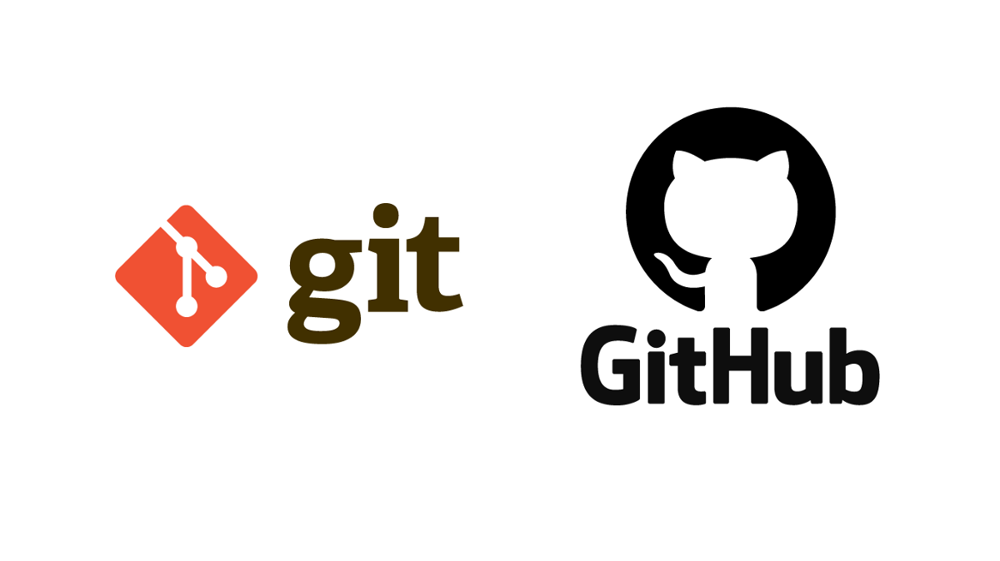
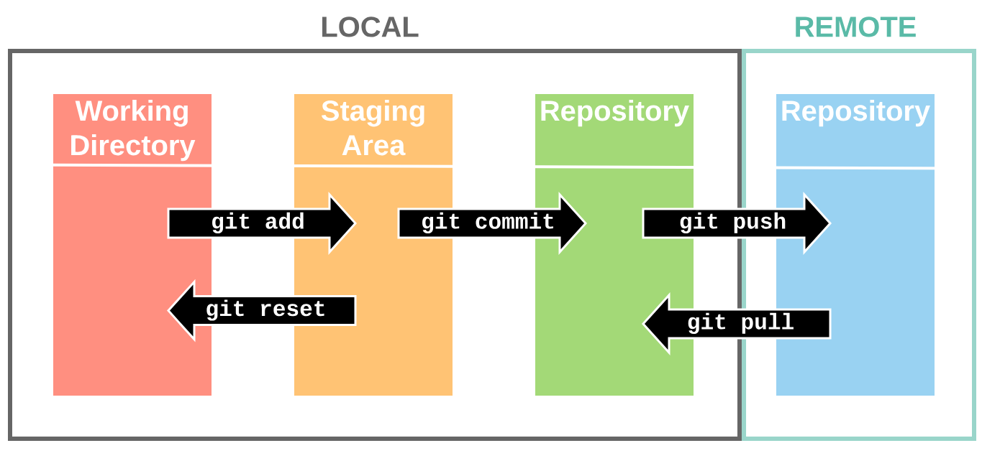
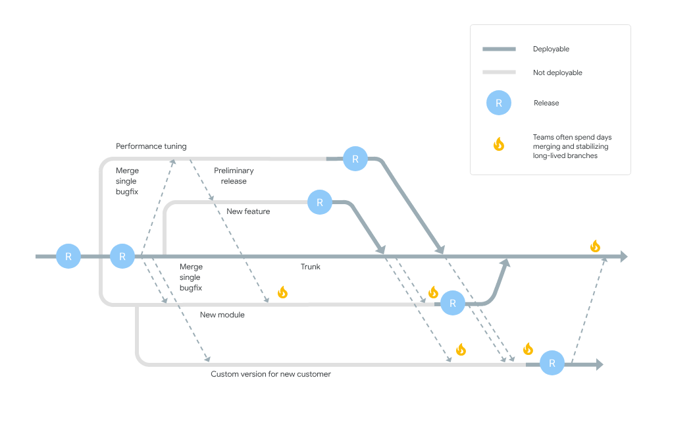
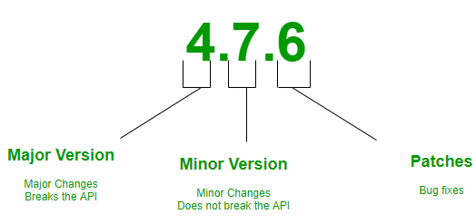

# Sesion 0 Guía de Git y GitHub



## Introducción a Git



Git es un sistema de control de versiones distribuido que permite rastrear los cambios realizados en un proyecto. Además, facilita el trabajo en equipo al permitir a los colaboradores trabajar en paralelo en diferentes funcionalidades del proyecto.

Algunas ventajas de utilizar Git son:

- Mantener un registro detallado de los cambios realizados en el proyecto.
- Facilitar la colaboración entre diferentes miembros del equipo.
- Permitir trabajar en distintas características o funcionalidades al mismo tiempo.

### Instalación

Para instalar Git, sigue estos pasos:

1. Descarga el instalador de Git desde el siguiente enlace: [Git](https://git-scm.com/downloads)
2. Ejecuta el instalador y sigue las instrucciones del asistente de instalación.
3. Verifica que la instalación se haya realizado correctamente ejecutando el siguiente comando en la terminal:

```bash
git --version
```

### Configuración

Antes de comenzar a usar Git, es importante configurar tu nombre de usuario y dirección de correo electrónico. Sigue estos pasos:

1. Configura tu nombre de usuario ejecutando el siguiente comando en la terminal:

```bash
git config --global user.name "<name>"
```

2. Configura tu correo electrónico ejecutando el siguiente comando en la terminal:

```bash
git config --global user.email "<email>"
```

3. Verifica que la configuración se haya realizado correctamente ejecutando el siguiente comando en la terminal:

```bash
git config --list
```

### Conceptos básicos

A continuación, se presentan algunos conceptos básicos de Git:

- **Repositorio**: Es un directorio que contiene todos los archivos y el historial de cambios del proyecto.
- **Commit**: Es un conjunto de cambios realizados en el proyecto que se agrupan como una única unidad.
- **Branch**: Es una línea de desarrollo independiente del proyecto que permite trabajar en una característica o solución sin afectar el código principal.
- **Staging area**: Es un área donde se almacenan los archivos que se van a incluir en el próximo commit.
- **Pull request**: Es una solicitud para que otro miembro del equipo revise el código y lo apruebe antes de fusionarlo con el proyecto principal.
- **Merge**: Es la acción de combinar dos branches para incorporar los cambios de uno en otro.
- **Tag**: Es una etiqueta que se le puede asignar a un commit para marcar versiones o hitos importantes.
- **Origin**: Es el nombre predeterminado del repositorio remoto.

### Comandos básicos

A continuación, se presentan algunos comandos básicos de Git:

- `git init`: Inicializa un repositorio Git en el directorio actual.
- `git status`: Muestra el estado actual del repositorio, incluyendo los archivos modificados y sin seguimiento.
- `git add .`: Agrega todos los archivos modificados al staging area para prepararlos para el commit.
- `git commit -m "<message>"`: Crea un commit con los archivos del staging area y agrega un mensaje descriptivo sobre los cambios realizados.
- `git push`: Sube los cambios locales al repositorio remoto (origin).
- `git pull`: Descarga los cambios del repositorio remoto y los fusiona con los cambios locales.

### Comandos avanzados

A continuación, se presentan algunos comandos avanzados de Git:

- `git add <file>`: Agrega un archivo específico al staging area.
- `git reset <file>`: Saca un archivo del staging area para excluirlo del próximo commit.
- `git log`: Muestra el historial de commits realizados en el repositorio.
- `git log -n <number>`: Muestra los últimos N commits en el historial.
- `git checkout <commit>`: Cambia el estado del repositorio al commit especificado, permitiendo explorar versiones anteriores del proyecto.
- `git tag -a <tag> -m "<message>"`: Crea un tag con un mensaje descriptivo para marcar versiones importantes del proyecto.

### Comandos de branches

A continuación, se presentan algunos comandos útiles para trabajar con branches:

- `git checkout <branch>`: Cambia el estado del repositorio al branch especificado.
- `git checkout -b <branch>`: Crea un nuevo branch y cambia al nuevo branch para continuar el desarrollo.
- `git branch`: Muestra una lista de los branches existentes en el repositorio.
- `git branch -d <branch>`: Elimina un branch después de haberlo fusionado en el branch principal.
- `git merge <branch>`: Combina los cambios del branch especificado con el branch actual.
- `git push origin <branch>`: Sube los cambios del branch especificado al repositorio remoto.
- `git pull origin <branch>`: Descarga los cambios del branch especificado del repositorio remoto.

## Estrategia de branching Trunk Based Development (TBD)



### Branches

El Trunk Based Development es una estrategia de branching que promueve la creación de branches cortos y la fusión frecuente con la rama principal, llamada main.

Cuando se crea un nuevo branch, se debe crear a partir de `main` y se debe nombrar de la siguiente manera:

`<tipo>/<nombre>`

Los tipos de ramas son los siguientes:

- **main**: Rama de producción que contiene el código estable y listo para ser implementado.
- **feature**: Ramas de desarrollo de nuevas características o funcionalidades que deben fusionarse en `main` cuando estén completas.
- **hotfix**: Ramas de corrección de errores críticos en el código de producción que deben fusionarse de manera urgente en `main`.
- **fix**: Ramas de corrección de errores que deben fusionarse en `main` después de solucionar problemas menores.
- **refactor**: Ramas de refactorización de código que deben fusionarse en `main` después de mejorar la estructura o eficiencia del código.
- **docs**: Ramas de documentación que deben fusionarse en `main` después de actualizar o mejorar la documentación del proyecto.
- **test**: Ramas de pruebas que deben fusionarse en `main` después de realizar pruebas y asegurar la calidad del código.

### Ejemplo práctico de branching

Supongamos que tenemos que desarrollar una nueva característica para el proyecto, que consiste en crear un nuevo endpoint para obtener información de un usuario. Sigamos estos pasos para trabajar con Git:

1. Crear un nuevo branch de tipo `feature` con el nombre `user-info` a partir de `main`.

```bash
git pull origin main # siempre que iniciamos un nuevo dia lo recomendable es traer los cambios de la rama main
git checkout -b feature/user-info
```

2. Trabajar en el branch feature/user-info hasta que la tarea esté completa y subir el branch al repositorio remoto para compartir el progreso con el equipo:

```bash
git add .
git commit -m "feat: add user info endpoint"
git push -u origin feature/user-info
```

3. Crear un Pull Request (PR) desde la interfaz de GitHub para que otro miembro del equipo revise el código y lo apruebe.

4. Una vez que el PR sea aprobado, hacer click en merge a la rama main y delete branch finalizado en merge desde la interfaz de GitHub.

5. Luego actualizar nuestra rama local con los nuevos cambios

```bash
# Cambiar a la rama main y actualizar los datos del repositorio
git checkout main
git pull origin main
```

6. Eliminar el branch `feature/user-info` del repositorio local:

```bash
git branch -d feature/user-info
git fetch --prune
```

## Estrategia de versionado



### Versiones

Para el versionado de los proyectos, se utilizará el siguiente formato:

`<major>.<minor>.<patch>`

- `major`: Cambios que rompen la compatibilidad con versiones anteriores.
- `minor`: Cambios que agregan funcionalidades sin romper la compatibilidad con versiones anteriores.
- `patch`: Cambios que corrigen errores sin romper la compatibilidad con versiones anteriores.

### Ejemplo práctico de versionado

Supongamos que tenemos que versionar el proyecto, y que la versión actual es `1.0.0`. Sigamos estos pasos para incrementar la versión:

Si se realizan cambios que rompen la compatibilidad con versiones anteriores, incrementar el major:

```bash
git tag -a 2.0.0 -m "breaking changes v2.0.0"
git push origin 2.0.0
```

Si se realizan cambios que agregan funcionalidades sin romper la compatibilidad con versiones anteriores, incrementar el minor:

```bash
git tag -a 1.1.0 -m "new features v1.1.0"
git push origin 1.1.0
```

Si se realizan cambios que corrigen errores sin romper la compatibilidad con versiones anteriores, incrementar el patch:

```bash
git tag -a 1.0.1 -m "bug fixes v1.0.1"
git push origin 1.0.1
```
