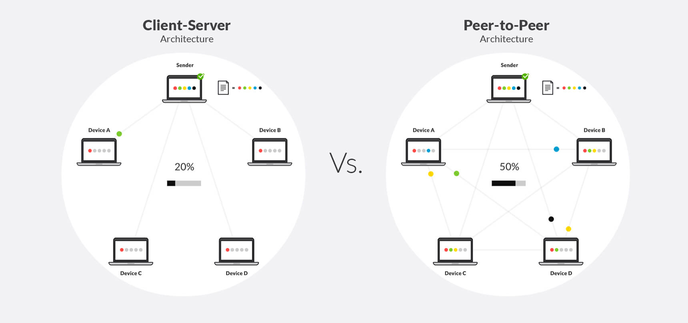
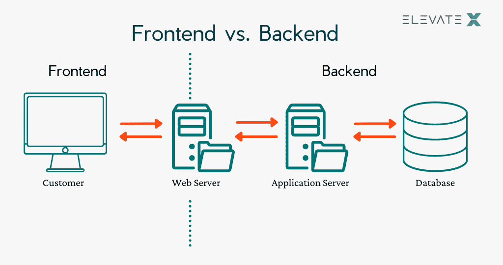
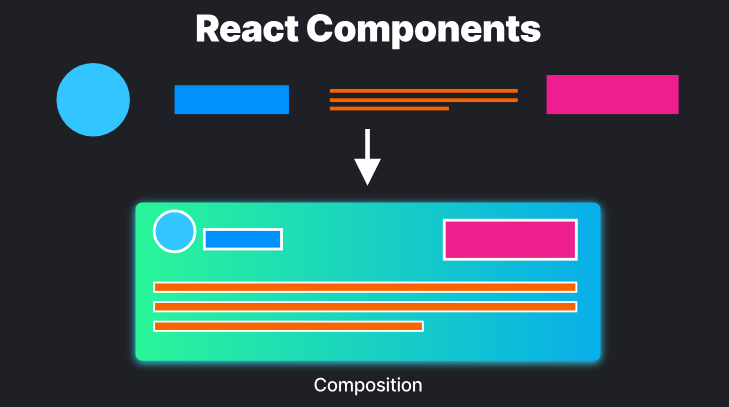
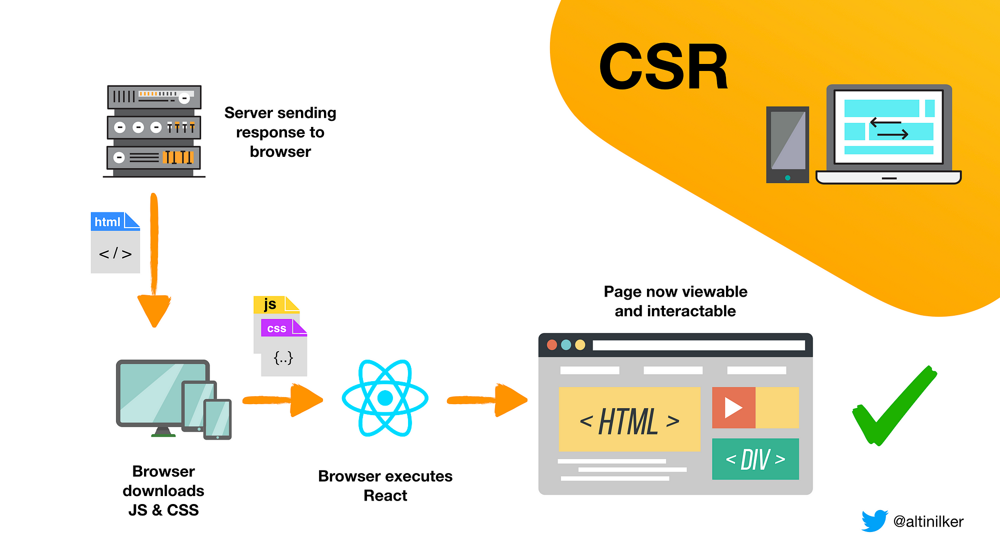
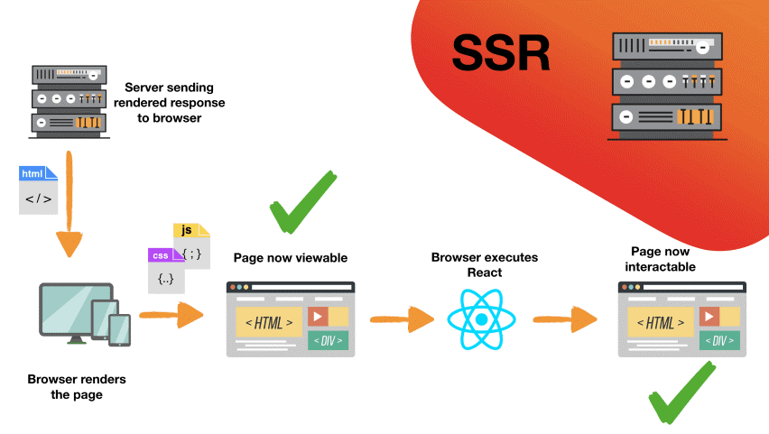

# Sesión 1 - Configuración del entorno de desarrollo y creación de una página con React.

## Configuración del entorno de desarrollo

### Instalación de Node.js

Para instalar Node.js, debemos ir a la página oficial de [Node.js](https://nodejs.org/es/) y descargar el instalador para nuestro sistema operativo.

> **Nota:** Se recomienda instalar la versión LTS.

Verificar la instalación de Node.js con el comando `node --version` en una terminal.

### Instalación de Git

Para instalar Git, debemos ir a la página oficial de [Git](https://git-scm.com/) y descargar el instalador para nuestro sistema operativo.

> Se recomienda usar winget tool para instalar Git en Windows, usando el comando `winget install --id Git.Git -e --source winget` en una terminal con permisos de administrador.

Verificar la instalación de Git con el comando `git --version` en una terminal.

#### Configuracion de Git

Para configurar Git, debemos abrir una terminal y ejecutar los siguientes comandos:

```bash
git config --global user.name "Nombre Apellido"
git config --global user.email "correo@ejemplo.com"
```

### Instalación de React Developer Tools

Para instalar React Developer Tools, debemos ir a la página oficial de [React Developer Tools](https://chrome.google.com/webstore/detail/react-developer-tools/fmkadmapgofadopljbjfkapdkoienihi) y descargar el instalador para nuestro navegador.

Es util para depurar aplicaciones de React en el navegador.

### Instalación de Visual Studio Code

Para instalar Visual Studio Code, debemos ir a la página oficial de [Visual Studio Code](https://code.visualstudio.com/) y descargar el instalador para nuestro sistema operativo.

> Se recomienda instalar la version de 64 bits para Windows ademas se puede instalar desde la tienda de aplicaciones de Windows.

#### Extensiones de Visual Studio Code

Vamos a instalar las siguientes extensiones que son de uso frecuente en el desarrollo de aplicaciones con React:

- [ESLint](https://marketplace.visualstudio.com/items?itemName=dbaeumer.vscode-eslint) Se utiliza para verificar el código con las reglas de ESLint.
- [Prettier](https://marketplace.visualstudio.com/items?itemName=esbenp.prettier-vscode) Se utiliza para formatear el código con las reglas de Prettier.
- [ES7 React/Redux/GraphQL/React-Native snippets](https://marketplace.visualstudio.com/items?itemName=dsznajder.es7-react-js-snippets) Se utiliza para agregar snippets de código para React.
- [Live Server](https://marketplace.visualstudio.com/items?itemName=ritwickdey.LiveServer) Se utiliza para iniciar un servidor local para la aplicación.
- [GitLens — Git supercharged](https://marketplace.visualstudio.com/items?itemName=eamodio.gitlens) Se utiliza para agregar funcionalidades de Git a Visual Studio Code.

## Introducción a la programación web

### HTML


HTML (HyperText Markup Language) es el lenguaje de marcado estándar para crear páginas web. HTML describe la estructura de una página web semánticamente y originalmente incluía instrucciones para la apariencia de la página web. HTML se utiliza para crear páginas web y aplicaciones web.

```html
<!DOCTYPE html>
<head>
    <meta charset="UTF-8" />
    <meta name="viewport" content="width=device-width, initial-scale=1.0" />
    <title>Mi primer HTML</title>
</head>
<body>
    <h1>Hola Mundo</h1>
</body>
```

### CSS


CSS (Cascading Style Sheets) es un lenguaje de hojas de estilo utilizado para describir la presentación de un documento escrito en HTML. CSS describe cómo se deben mostrar los elementos HTML en la pantalla, en papel o en otros medios. CSS se utiliza para crear páginas web y aplicaciones web.

```css
h1 {
    color: red;
}
```

### JavaScript


JavaScript es un lenguaje de programación de alto nivel, dinámico, débilmente tipado e interpretado. JavaScript se utiliza principalmente en el lado del cliente para crear páginas web y aplicaciones web interactivas. JavaScript también se puede utilizar en el lado del servidor a través de Node.js.

```javascript
function helloWorld() {
    const helloWorld = "Hola Mundo";
    console.log(helloWorld);
}
```

## Introducción a las aplicaciones web

### Arquitectura Cliente-Servidor



El modelo cliente-servidor es un modelo de computación distribuida en el que las tareas se dividen entre los servidores y los clientes. En este modelo, el cliente solicita recursos y servicios del servidor, y el servidor responde a estas solicitudes. El cliente y el servidor se comunican entre sí utilizando el protocolo HTTP (Hypertext Transfer Protocol).


### Frontend y Backend



El frontend y el backend son dos partes de una aplicación web. El frontend es la parte de la aplicación web que interactúa con los usuarios. El backend es la parte de la aplicación web que interactúa con la base de datos y otros servicios.

### Bases de datos


Una base de datos es un sistema de almacenamiento de datos que permite almacenar, organizar y recuperar datos fácilmente. Las bases de datos se utilizan para almacenar datos de forma permanente y se pueden acceder a través de aplicaciones web o aplicaciones de escritorio.

## Conceptos basicos de React

### ¿Qué es React?


Es una librería de JavaScript utilizada para construir interfaces de usuario. React se ha convertido en una de las librerías más populares para el desarrollo de aplicaciones web.

> **Nota:** Una **libreria** es un conjunto de funciones y componentes que se pueden usar para crear aplicaciones de software. Mientras que un **framework** es un conjunto de herramientas y componentes que se pueden usar para crear aplicaciones de software.

React es una librería de código abierto mantenida por Meta tiene una gran comunidad de desarrolladores individuales y empresas. React se utiliza en miles de sitios web, incluyendo algunas de las aplicaciones más grandes del mundo como Netflix, Facebook, Instagram, etc.

### ¿Por qué usar React?


Basado en el concepto de componentes, React permite crear interfaces de usuario interactivas y reutilizables. React también ayuda a mantener las interfaces de usuario complejas organizadas y facilita la integración con otras librerías y frameworks.



### Ventajas y desventajas de React

| Ventajas | Desventajas |
| --- | --- |
| Fácil de aprender | Solo es una librería |
| Reutilizable | Constante cambio |
| Fácil de integrar | Renderizado en el lado del cliente |

#### Ventajas de usar React

- **Fácil de aprender:** React es una librería de JavaScript, por lo que es fácil de aprender si ya conoces JavaScript.
- **Reutilizable:** React permite reutilizar componentes, lo que permite ahorrar tiempo y esfuerzo.
- **Fácil de integrar:** React se puede integrar fácilmente con otras librerías y frameworks como Bootstrap, Angular, etc.

#### Desventajas de usar React

- **Solo es una librería:** React es solo una librería, por lo que no tiene soporte para otras funcionalidades como enrutamiento, manejo de formularios, etc. Para esto, necesitamos usar otras librerías.
- **Constante cambio:** React es una librería en constante cambio, por lo que es posible que tengamos que actualizar nuestras aplicaciones con frecuencia.
- **Renderizado en el lado del cliente:** React renderiza las interfaces de usuario en el lado del cliente, por lo que no es adecuado para aplicaciones que requieren un alto rendimiento en el lado del servidor.

### DOM y Virtual DOM


El DOM (Document Object Model) es una representación de la estructura de un documento HTML. Este se utiliza para representar la estructura de un documento HTML en forma de árbol. 

Cuando hablamos de DOM virtual, nos referimos a una representación virtual de la estructura de un documento HTML.  Cada vez que hay un cambio en el estado de una aplicación web, el navegador debe actualizar el DOM, lo que puede resultar en una pérdida de rendimiento, especialmente cuando hay muchas actualizaciones.

> El Virtual DOM en React actúa como una capa intermedia entre el estado de la aplicación y el DOM del navegador.

La principal ventaja del Virtual DOM es que permite a React optimizar el rendimiento al reducir la cantidad de operaciones costosas de manipulación del DOM. En lugar de actualizar el DOM directamente cada vez que cambia el estado, React realiza un proceso de comparación y actualización eficiente en el Virtual DOM. Esto resulta en una mejora notable en el rendimiento y la velocidad de las aplicaciones web construidas con React

### Renderizados en react

#### Renderizado en el lado del cliente



El renderizado en el lado del cliente es un proceso en el que el navegador descarga un archivo HTML vacío y luego lo rellena con el contenido descargado del servidor. El renderizado del lado del cliente se utiliza principalmente en aplicaciones web de una sola página (SPA) donde el contenido se actualiza dinámicamente.
#### Renderizado en el lado del servidor



El renderizado del lado del servidor es un proceso en el que el servidor genera el HTML de la página web y lo envía al navegador. El renderizado del lado del servidor se utiliza principalmente en aplicaciones web que no son de una sola página (no SPA) donde el contenido no se actualiza dinámicamente.

### ¿Qué es JSX?


JSX (JavaScript XML) es una extensión de JavaScript que permite escribir código similar a HTML dentro de JavaScript. Esta sintaxis se utiliza principalmente en React, aunque es opcional y se puede utilizar sin React también. JSX ofrece una forma más intuitiva y legible de crear elementos de la interfaz de usuario.

Por ejemplo si usamos JSX, podemos definir elementos en React de la siguiente forma:

```jsx
const element = <h1 className="text-2xl"> Hola Mundo </h1>;
```

pero si no usamos JSX, podemos definir elementos en React de la siguiente forma:

```javascript
const element = React.createElement("h1", { className: "text-2xl" }, "Hola Mundo");
```


Aunque esto parece código HTML, JSX se compila en llamadas a funciones de JavaScript regulares. Cuando se utiliza en un entorno de React, estas llamadas a funciones de JSX producen objetos de React, que luego se procesan para crear elementos de React.

> **Nota:** JSX no es un requisito para usar React, pero es una característica muy útil que facilita la creación de elementos de la interfaz de usuario. Se recomienda usar JSX para la creación de elementos de la interfaz de usuario.

### ¿Qué es Babel?


Babel es un transpilador de JavaScript que permite a los desarrolladores utilizar características de JavaScript más recientes en navegadores y entornos que aún no las admiten completamente. Babel puede convertir el código JSX en JavaScript regular, lo que permite que se ejecute en navegadores que no entienden JSX de forma nativa.

> **Nota:** Transpilador es un tipo especial de compilador que traduce de un lenguaje fuente a otro fuente también de un nivel de abstracción parecido. Para mas informacion visitar el siguiente [enlace](https://es.linkedin.com/pulse/compilaci%C3%B3n-transpilaci%C3%B3n-e-interpretes-ariel-alejandro-wagner).

En lugar de ser un compilador completo, Babel toma el código JavaScript moderno y lo transforma en una versión anterior de JavaScript que es más ampliamente compatible con los navegadores y entornos actuales.

Algunas de las características que Babel nos permite usar son:

- Uso de sintaxis de JavaScript que aún no se ha aprobado.
- Funciones flecha (->).
- Métodos de matriz como `map`, `filter`, `reduce`, etc.
- La palabra clave `class` para definir clases.
- Metodos `async` y `await`.
- Podemos encontrar mas características en [ECAM - Internacional](https://www.ecma-international.org/publications-and-standards/standards/ecma-262/)

#### Alternativas a Babel

- **SWC:** SWC (Speedy WebAssembly Compiler) es un transpilador de JavaScript y TypeScript escrito en Rust. Es conocido por su alta velocidad y rendimiento. Puede ser una excelente alternativa a Babel si estás buscando una herramienta más rápida para transpilar tu código.
- **Esbuild:** Esbuild es otra opción rápida y eficiente para transpilar código JavaScript. Está escrito en Go y se destaca por su velocidad y facilidad de uso. Esbuild puede ser especialmente útil en proyectos donde el tiempo de construcción es un factor crítico.
- **Sucrase:** Sucrase se enfoca en la transpilación rápida y sencilla de código JavaScript moderno (como JSX y TypeScript) a JavaScript más antiguo. Está diseñado para ser más rápido que Babel, especialmente en proyectos grandes.
- **Traceur:** Traceur es un transpilador mantenido por Google que permite utilizar características de JavaScript más modernas en navegadores más antiguos. Aunque ya no es tan popular como Babel, sigue siendo una opción válida para algunos casos de uso.

## ¿Qué es Webpack?


Webpack es una herramienta de código abierto ampliamente utilizada en el desarrollo web, especialmente en proyectos basados en JavaScript. Su principal función es el empaquetado y la generación de bundles (paquetes) de archivos estáticos, como JavaScript, CSS, HTML y otros tipos de archivos. Estos paquetes se optimizan y se preparan para ser utilizados en entornos de producción.

Webpack se puede considerar como un Task Runner muy especializado en el procesamiento de unos archivos de entrada para convertirlos en otros archivos de salida, para lo cual utiliza unos componentes que se denominan loaders.

Webpack es muy popular en el ecosistema de JavaScript y se ha convertido en una parte integral del desarrollo moderno de aplicaciones web, especialmente en proyectos basados en frameworks como React, Angular o Vue.js.


### Alternativas a Webpack

- **Vite:** Vite es una excelente alternativa a Webpack para proyectos React. Se destaca por su tiempo de desarrollo rápido y su configuración cero para proyectos React. Utiliza el soporte nativo para módulos ES y ofrece una experiencia de desarrollo altamente eficiente.
- **Parcel:** Parcel es otra opción popular para proyectos React. Al igual que Vite, Parcel también ofrece una configuración cero, lo que la hace muy fácil de usar. Proporciona una experiencia de desarrollo rápida y es especialmente útil para proyectos más pequeños o prototipos.
- **Rollup:** Aunque inicialmente se enfocaba más en el empaquetado de bibliotecas, Rollup también puede utilizarse para proyectos React. Ofrece una configuración más sencilla que Webpack y es adecuado para aplicaciones más pequeñas y optimización de paquetes de producción.
- **Snowpack:** Snowpack es otra herramienta que se ha ganado atención en el ecosistema de React. Se enfoca en un tiempo de desarrollo rápido y ofrece una experiencia de desarrollo cercana a Vite y Parcel.


## Actividad Practica

Bienvenido a la primera actividad práctica del curso. En esta actividad, crearemos una aplicación web simple con React. Esta aplicación mostrará un mensaje de "Hola mundo" en el navegador.

### Proyecto simple con React

Crearemos una carpeta llamada `react-hello-world` y abriremos una terminal en esa carpeta. Luego, ejecutaremos el siguiente comando.

```bash
code .
```

Este comando abrirá Visual Studio Code en la carpeta actual. Luego, crearemos un archivo llamado `index.html` en la carpeta `react-hello-world` y agregaremos el siguiente código HTML.

```html
<!DOCTYPE html>
<html lang="es">
    <head>
        <meta charset="UTF-8" />
        <meta name="viewport" content="width=device-width, initial-scale=1.0" />
        <title>React "Hola Mundo"</title>
        <style>
            .text-red-500 {
                color: rgb(239 68 68);
            }
        </style>
    </head>
    <body>
        <div id="root"></div>
    </body>
</html>
```

Luego, necesitamos agregar el script de React y ReactDOM en el archivo HTML. Podemos usar los scripts de React alojados en un CDN o podemos instalar React en nuestro proyecto usando npm.En este caso usaremos los scripts alojados en un CDN.

```html
<script crossorigin src="https://unpkg.com/react@16.7.0/umd/react.production.min.js"></script>
<script crossorigin src="https://unpkg.com/react-dom@16.7.0/umd/react-dom.production.min.js"></script>
```

> **Nota:** El uso de `crossorigin` ayuda a evitar errores de CORS (Cross-Origin Resource Sharing) en algunos navegadores.

Ademas necesitamos agregar el script de Babel para poder utilizar JSX en nuestro proyecto.

```html
<script src="https://unpkg.com/@babel/standalone/babel.min.js">
```

Ahora agregaremos un script que renderice el mensaje de "Hola mundo" en el elemento `<div>` con el `id` de `root`.

```html
<script type="text/babel">
    function App() {
        return <h1 class="text-red-500">Hola Mundo desde React</h1>;
    }

    ReactDOM.render(<App />, document.getElementById("root"));
</script>
```

Finalmente ejecutaremos el archivo `index.html` usando la extensión `Live Server` de Visual Studio Code.

Genial, funciona :grin: pero podemos mejorar el código, separando los componentes en archivos diferentes.

### Separando los archivos de la aplicación

Primero crearemos estos archivos en nuestra carpeta `react-hello-world`:

- `index.html`
- `main.js`
- `main.css`

Luego agregaremos el siguiente código HTML en el archivo `index.html`.

```html
<!DOCTYPE html>
<html lang="es">
    <head>
        <meta charset="UTF-8" />
        <meta name="viewport" content="width=device-width, initial-scale=1.0" />
        <link rel="stylesheet" href="./main.css" />
        <title>React "Hola Mundo"</title>
    </head>
    <body>
        <div id="root"></div>
        <!-- Agregamos al proyecto React y React DOM -->
        <script crossorigin src="https://unpkg.com/react@16.7.0/umd/react.production.min.js"></script>
        <script crossorigin src="https://unpkg.com/react-dom@16.7.0/umd/react-dom.production.min.js"></script>
        <!-- Agregamos al proyecto Babel  -->
        <script src="https://unpkg.com/@babel/standalone/babel.js"></script>
        <script type="text/babel" src="./main.js"></script>
    </body>
</html>
```

Luego agregaremos el siguiente código JavaScript en el archivo `main.js`.

```js
function App() {
    return <h1 className="text-red-500">Hola Mundo desde React</h1>;
}

ReactDOM.render(<App />, document.getElementById("root"));
```	

Y finalmente agregaremos el siguiente código CSS en el archivo `main.css`.

```css
.text-red-500 {
    color: rgb(239 68 68);
}
```

Ahora compilamos el código y abrimos el archivo `index.html` en el servidor local.

## Actividad de reforzamiento

Crear una aplicacion con React usando 4 elementos: 

- Un titulo
- Una imagen 
- Un boton de like :heart:
- Una descripción

Ejemplo de archivo `main.js`:

```js
function App() {
    return (
        <div>
            <h1> Titulo </h1>
            
            <button> &#10084; </button>
            <p> Descripcion de la foto </p>
        </div>
    );
}

//resto del codigo
```

## Bibliografía

1. [Documentacion de ReactJS](https://reactjs.org/)
2. [Patterns ReactJS](https://www.patterns.dev/posts/reactjs)
3. [ReactJS Wiki](https://www.reactjs.wiki/)
4. [ECAM Internacional](https://www.ecma-international.org/publications-and-standards/standards/ecma-262/)
5. [Freecodecamp Babel](https://www.freecodecamp.org/espanol/news/que-es-babel)
6. [Campusmcvp Webpack](https://www.campusmvp.es/recursos/post/webpack-que-es-para-que-sirve-y-sus-ventajas-e-inconvenientes.aspx)